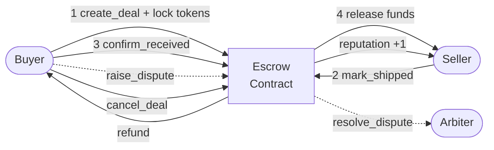

<div align="center">

# OyaShip Smart Contract

**Soroban escrow contract for trustless cross-border trade on Stellar.**

[](https://www.rust-lang.org/)
[](https://soroban.stellar.org/)
[](https://stellar.org/)
[](https://opensource.org/licenses/MIT)

</div>

---

## Overview

This is the escrow smart contract for **OyaShip** — a social commerce platform where importers and suppliers transact safely using onchain escrow on Stellar.

The contract manages the full deal lifecycle: a buyer locks tokens, a seller ships goods, the buyer confirms receipt, and the contract releases funds. If a dispute arises, a designated arbiter resolves it onchain.

Written in **Rust** using the **Soroban SDK**. Deployed on **Stellar testnet**.

**Related repos:**
- [OyaShip/mobile](https://github.com/OyaShip/mobile) — SwiftUI iOS app
- [OyaShip/backend](https://github.com/OyaShip/backend) — Node.js API

---

## Why Soroban on Stellar?

| Property | Why it matters for escrow |
|---|---|
| **5-second finality** | Buyer locks funds and seller receives payment in seconds — feels like a normal payment app |
| **Near-zero fees** | ~$0.000001 per transaction — even a $50 trade is viable (impossible on Ethereum L1) |
| **Rust safety** | Memory-safe, no null pointers, no buffer overflows — critical for a contract holding real money |
| **Native multi-currency** | Stellar's anchor network enables USDC, EURC, and local fiat tokens natively |
| **Path payments** | Buyer can pay in NGN, seller receives CNY — the Stellar DEX handles conversion automatically |
| **Built for payments** | Stellar was designed for cross-border value transfer, not DeFi speculation |

---

## Deal Lifecycle



### Status Flow

```
Created ──→ Shipped ──→ Confirmed (funds released)
   │            │
   │            └──→ Disputed ──→ Resolved (arbiter decides)
   │
   ├──→ Cancelled (buyer refunded)
   └──→ Disputed ──→ Resolved
```

---

## Contract Functions

### Write Functions

| Function | Caller | What it does |
|---|---|---|
| `initialize(arbiter)` | Deployer | Set the arbiter address (one-time setup) |
| `create_deal(buyer, seller, amount, description, deadline)` | Buyer | Lock tokens in contract, create deal with status `Created` |
| `mark_shipped(seller, deal_id)` | Seller | `Created` → `Shipped` |
| `confirm_received(buyer, deal_id)` | Buyer | `Shipped` → `Confirmed`, release funds to seller, +1 reputation |
| `cancel_deal(buyer, deal_id)` | Buyer | `Created` → `Cancelled`, refund buyer (only before shipment) |
| `raise_dispute(caller, deal_id)` | Buyer or Seller | `Created`/`Shipped` → `Disputed` |
| `resolve_dispute(arbiter, deal_id, refund_buyer)` | Arbiter | `Disputed` → `Resolved`, send funds to winner |

### Read Functions

| Function | Returns |
|---|---|
| `get_deal(deal_id)` | Full deal struct (buyer, seller, amount, status, timestamps) |
| `get_reputation(user)` | Number of completed deals for a user |

---

## Data Types

```rust
enum DealStatus {
    Created,      // buyer locked funds
    Shipped,      // seller marked shipped
    Confirmed,    // buyer confirmed, funds released
    Disputed,     // either party escalated
    Resolved,     // arbiter resolved
    Cancelled,    // buyer cancelled before shipment
}

struct Deal {
    id: u64,
    buyer: Address,
    seller: Address,
    amount: i128,
    description: String,
    status: DealStatus,
    created_at: u64,
    deadline: u64,
}
```

---

## Storage

| Key | Type | Description |
|---|---|---|
| `Deal(u64)` | `Deal` | Deal struct by ID |
| `NextDealId` | `u64` | Auto-incrementing deal counter |
| `Arbiter` | `Address` | Authorized dispute resolver |
| `UserDeals(Address)` | `Vec<u64>` | Deal IDs associated with a user |
| `Reputation(Address)` | `u64` | Completed deals count per user |

---

## Security

- **`require_auth()`** on every state-changing function — only the authorized party can act
- **Status guards** — each function checks the current deal status before transitioning
- **Buyer != seller** — the contract rejects deals where buyer and seller are the same address
- **Amount > 0** — no zero-value deals
- **Arbiter is immutable** — set once during initialization, cannot be changed
- **Arbiter can only resolve to buyer or seller** — no arbitrary withdrawal path

---

## Project Structure

```
smartcontract/
├── Cargo.toml                         Workspace config
├── contracts/
│   └── oyaship-escrow/
│       ├── Cargo.toml                 Crate config (soroban-sdk 21.7.1)
│       └── src/
│           └── lib.rs                 Full escrow contract
└── scripts/
    └── deploy.sh                      Testnet deployment script
```

---

## Getting Started

### Prerequisites

- **Rust** (stable) — [rustup.rs](https://rustup.rs/)
- **Soroban CLI** — [installation guide](https://soroban.stellar.org/docs/getting-started/setup)
- **wasm32 target** — `rustup target add wasm32-unknown-unknown`

### Build

```bash
git clone https://github.com/OyaShip/smartcontract.git
cd smartcontract
soroban contract build
```

The compiled WASM will be at `target/wasm32-unknown-unknown/release/oyaship_escrow.wasm`.

### Test

```bash
cargo test
```

### Deploy to Stellar Testnet

```bash
# Configure identity (one-time)
soroban keys generate default --network testnet
soroban keys fund default --network testnet

# Deploy
chmod +x scripts/deploy.sh
./scripts/deploy.sh
```

The script will:
1. Build the contract
2. Deploy the WASM to Stellar testnet
3. Initialize the contract with your address as arbiter
4. Print the contract ID

### Interact

```bash
# Create a deal
soroban contract invoke \
  --id <CONTRACT_ID> \
  --network testnet \
  --source buyer-identity \
  -- create_deal \
  --buyer <BUYER_ADDRESS> \
  --seller <SELLER_ADDRESS> \
  --amount 1000000000 \
  --description "500 phone cases" \
  --deadline 1720000000

# Mark shipped
soroban contract invoke \
  --id <CONTRACT_ID> \
  --network testnet \
  --source seller-identity \
  -- mark_shipped \
  --seller <SELLER_ADDRESS> \
  --deal_id 0

# Confirm received (releases funds)
soroban contract invoke \
  --id <CONTRACT_ID> \
  --network testnet \
  --source buyer-identity \
  -- confirm_received \
  --buyer <BUYER_ADDRESS> \
  --deal_id 0
```

---

## Roadmap

- [x] Full escrow lifecycle (create, ship, confirm, cancel, dispute, resolve)
- [x] Onchain reputation counter
- [x] Per-user deal tracking
- [ ] Token transfer integration (lock/release XLM or USDC)
- [ ] Multi-token support via Stellar assets
- [ ] Deadline enforcement (auto-cancel if seller doesn't ship)
- [ ] Event emission for indexing
- [ ] Comprehensive test suite with soroban testutils
- [ ] Mainnet deployment

---

## License

MIT
